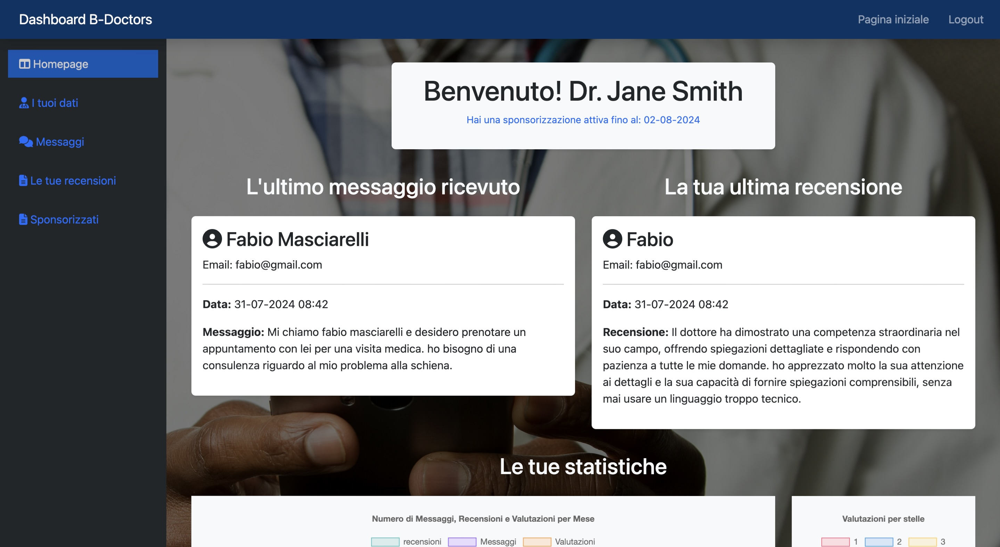
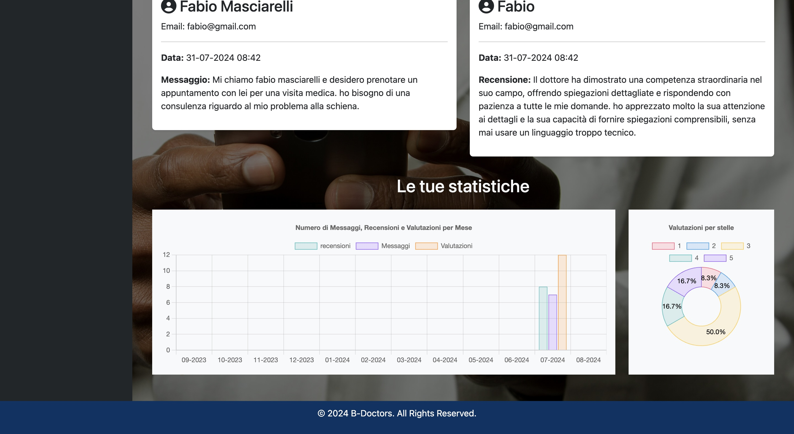
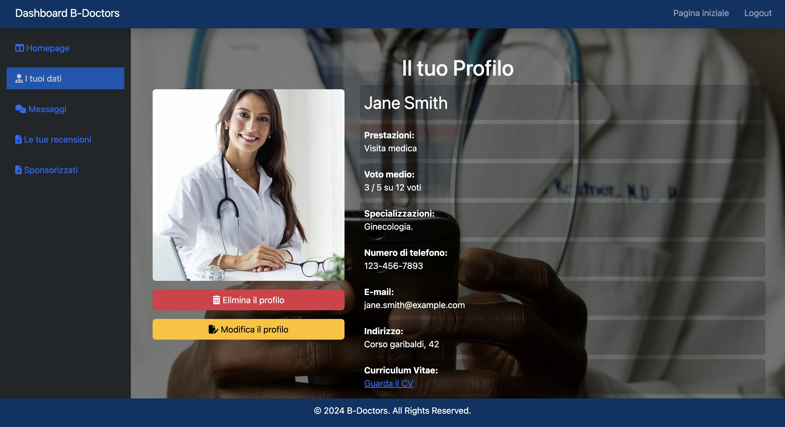
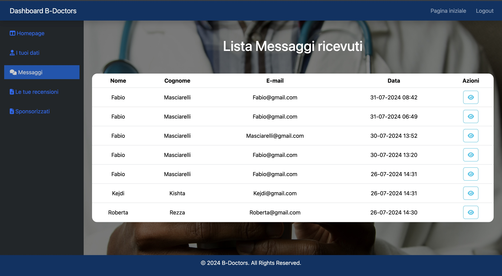
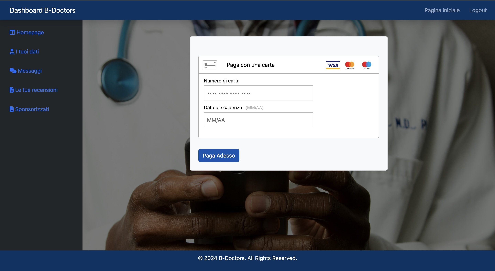
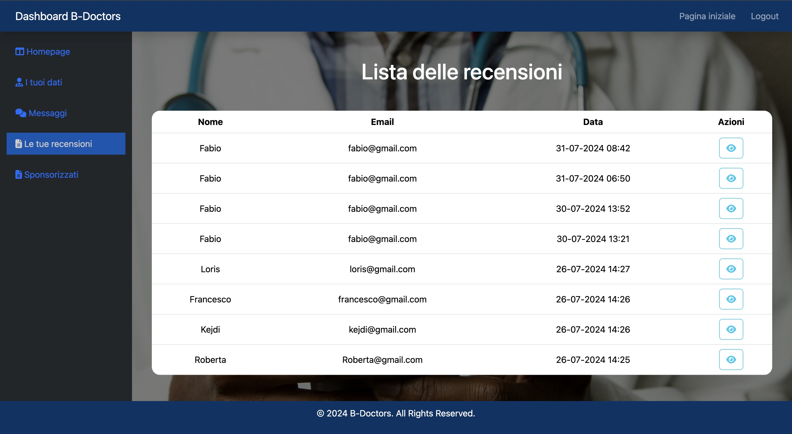
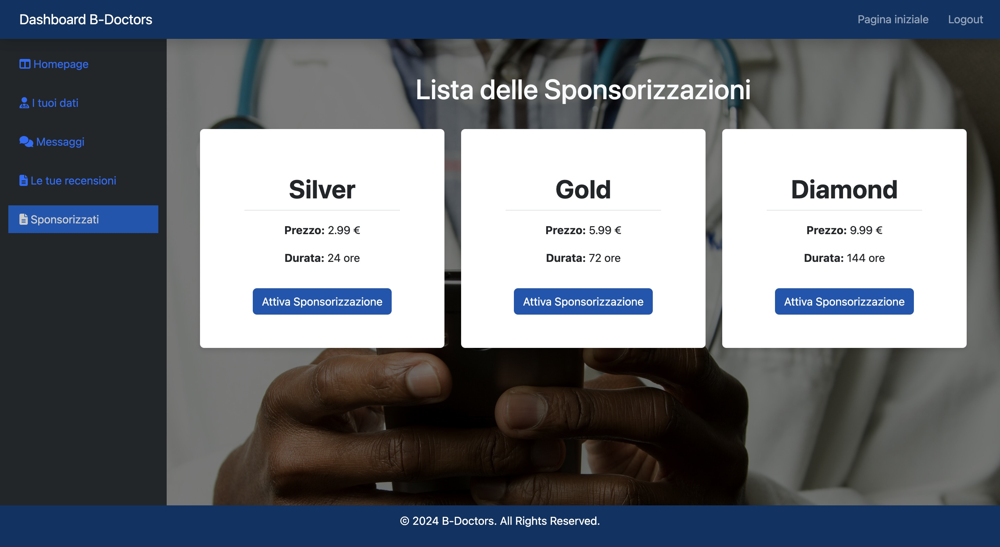

### BDoctors FrontEnd

---

Team development of a responsive site where users can search for doctors through filters, contact them, insert a review and a rating. Doctors can view this information in the dashboard after logging in. Used Vite, Vue.js, Laravel and MySQL.

